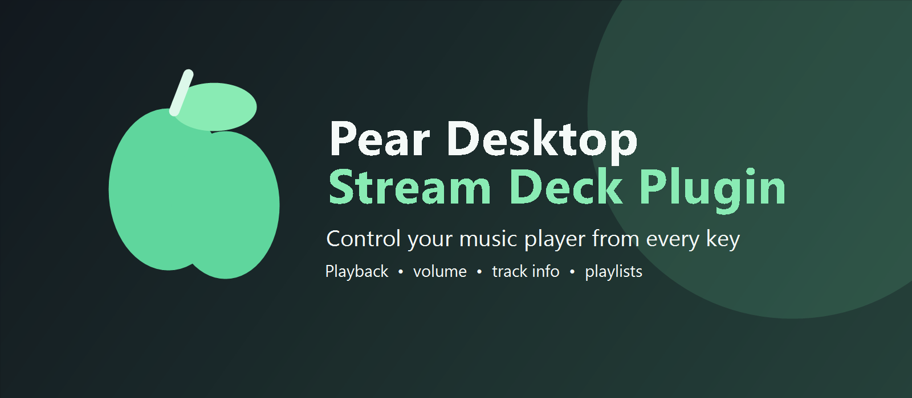

# Pear Desktop Stream Deck Plugin



Control [Pear Desktop Music Player](https://github.com/XeroxDev/pear-desktop) from an Elgato Stream Deck. The plugin provides playback, track navigation, likes, dislikes, volume, track information, shuffle, repeat, and playlist controls.

## Install Pear Desktop Music Player

1. Open the [Pear Desktop releases page](https://github.com/XeroxDev/pear-desktop/releases).
2. Download the installer for your operating system.
3. Install Pear Desktop and launch it.
4. Open **Settings > Integrations** and enable the **Companion Server**.
5. Enable companion authorization if you want the plugin to authorize itself securely.

## Install the Stream Deck Plugin

### Download a release

1. Open the [Pear Desktop Stream Deck releases page](https://github.com/MrBattlefield/pear-desktop-streamdeck/releases).
2. Download the `.streamDeckPlugin` file from the latest release.
3. Double-click the downloaded file and approve the Stream Deck installation.
4. Open the Stream Deck application and add a Pear Desktop action to a key.

### Build and install the current source

Use this path to test the newest code before a GitHub release is available.

```powershell
git clone https://github.com/MrBattlefield/pear-desktop-streamdeck.git
cd pear-desktop-streamdeck
npm ci
npm run build
```

The installable plugin folder is created at `build/com.pear.desktop.streamdeck.sdPlugin`. To install it manually, copy that folder into the Stream Deck plugins directory and restart Stream Deck:

```text
%APPDATA%\Elgato\StreamDeck\Plugins\com.pear.desktop.streamdeck.sdPlugin
```

You can also install the Elgato CLI and package the build:

```powershell
npm install --global @elgato/cli
npm run prepare:streamdeck-cli
streamdeck validate build/com.pear.desktop.streamdeck.sdPlugin
streamdeck pack build/com.pear.desktop.streamdeck.sdPlugin --output build --force
```

## Connect the plugin

1. Make sure Pear Desktop and its Companion Server are running.
2. Add the **Play-Pause** action to a Stream Deck key.
3. Open the action settings and press **Authorize**.
4. Compare the code shown by the plugin with the code shown in Pear Desktop.
5. Confirm the authorization in Pear Desktop.
6. Add the remaining Pear Desktop actions to your Stream Deck.

Authorization is normally required only once per installation.

## Available actions

- Play or pause the current track
- Next and previous track
- Stream Deck+ and Stream Deck+ XL dial seeking with rotation and play/pause with dial press
- Stream Deck+ dial navigation mode: Previous Track, Play/Pause, and Next Track
- Like and dislike the current track
- Mute, increase, and decrease volume
- Track information with thumbnail, title, and artist
- Shuffle and repeat modes
- Play a selected playlist

## Stream Deck+ and Stream Deck+ XL dials

Add the **Play-Pause** action to an encoder on Stream Deck+ or Stream Deck+ XL. The action supports two selectable encoder modes in its Stream Deck settings:

- **Seek Track**: rotate left to seek backward 5 seconds, rotate right to seek forward 5 seconds, and press the dial to play or pause.
- **Previous / Play-Pause / Next**: rotate left for Previous Track, press for Play/Pause, and rotate right for Next Track.

The default is **Seek Track**, so existing configurations keep their current behavior.

## Icon themes

The repository includes four complete icon collections for users who want to customize the appearance of their Stream Deck buttons:

- `icons/themes/dark_filled`
- `icons/themes/dark_outlined`
- `icons/themes/light_filled`
- `icons/themes/light_outlined`

Each collection includes standard and `@2x` assets. To use a collection, copy its files over the matching files in `icons`, rebuild the plugin, and reinstall it. This changes the complete button set consistently while leaving the action behavior unchanged.

## Development

```powershell
npm ci
npm run build
```

The project uses TypeScript, esbuild, and the Elgato Stream Deck SDK. Changes are built into the `build` directory for local testing.

After a build has been tested and confirmed as a working milestone, save a local copy with:

```powershell
npm run archive-build -- 0.0.1
```

The package is saved under `local-builds/0.0.1/`. Confirmed milestones are published to GitHub Releases by bumping the project version and pushing the conventional commit that triggers the release workflow.

## Support

Report bugs and request features in the [GitHub issue tracker](https://github.com/MrBattlefield/pear-desktop-streamdeck/issues).

## License

This project is available under the [MIT License](LICENSE).
